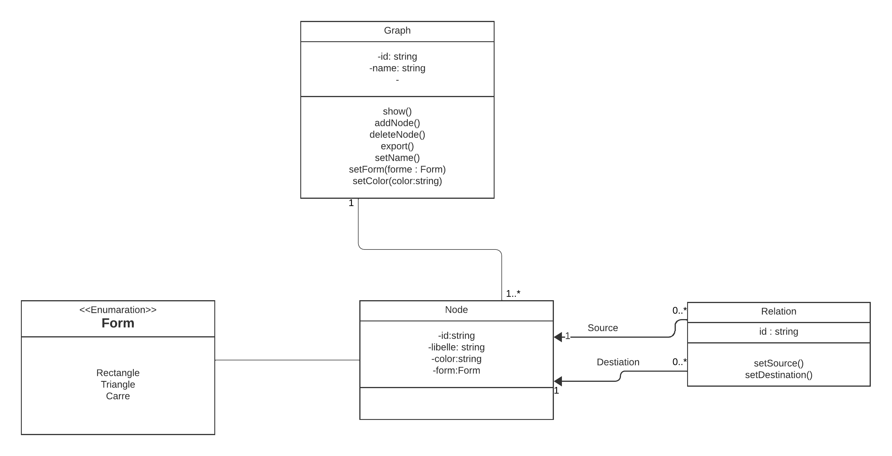
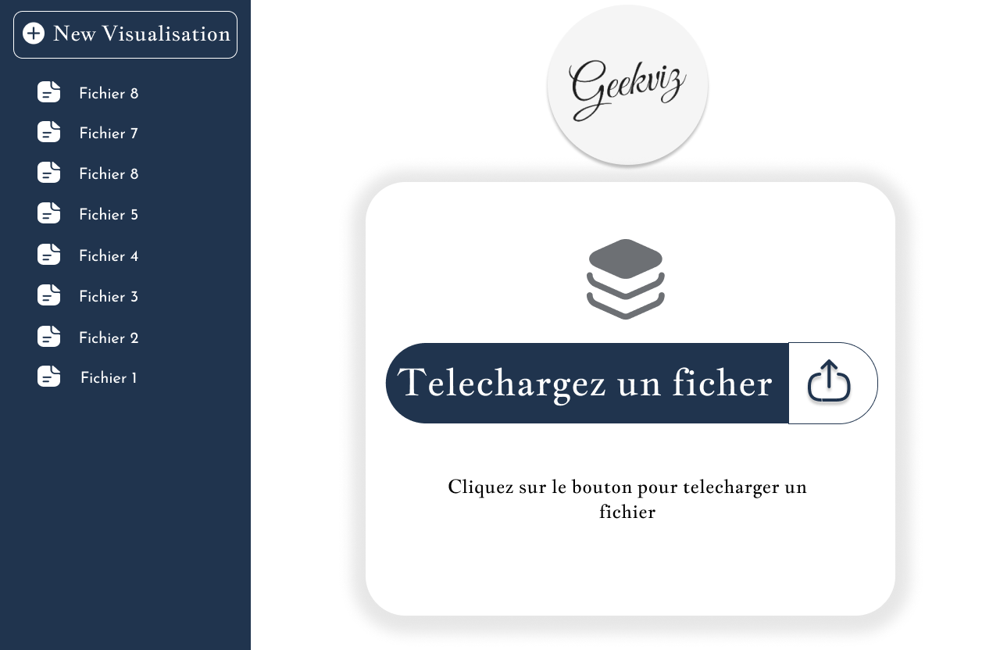
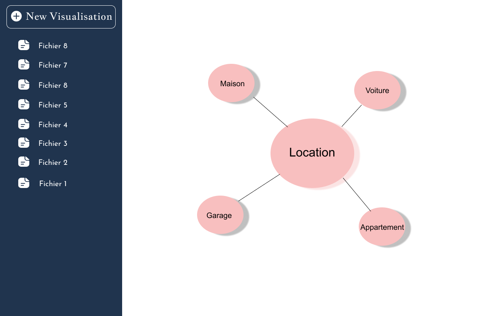
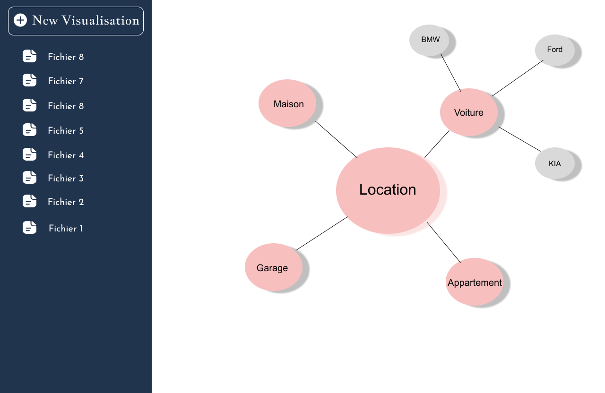

# Fiche technique
> Dans le cadre de notre projet nous avons utilisé la méthodologie UML pour la modélisation des différents diagrammes.

## 1.	Diagramme de cas d’utilisation
Le diagramme de cas d’utilisation ci-dessous illustre les principales fonctionnalités de notre l’application :


## 2.	Diagramme de classe
Après avoir tracé les grandes lignes de la phase de spécification des besoins,
mettons maintenant l’accent sur la spécification de l’architecture de système.
### 	**Règles de gestion**
- Un graphe peut avoir plusieurs nœuds.
- Un nœud appartient à un et un seul graphe
- Une relation a un et un seul nœud source.
- Une relation a un et un seul nœud destination.
### 	**Schéma du diagramme de classe**


## 3.	Spécifications techniques
###     **Formats de données**
Notre programme prend en entré un fichier JSON qui contient la description de notre graphe. Le fichier contient un objet JSON qui représente notre graphe. Ci-dessous un exemple du format :
```json
{
   	nodes: [
     		{ id: 1, label: "1", title: "node 1 tootip text" },
    		{ id: 2, label: "2", title: "node 2 tootip text" },
      		{ id: 3, label: "3", title: "node 3 tootip text" },
      		{ id: 4, label: "4", title: "node 4 tootip text" },
      		{ id: 5, label: "5", title: "node 5 tootip text" },
    		],
    	relations: [
      		{ from: 1, to: 2 },
      		{ from: 1, to: 3 },
      		{ from: 2, to: 4 },
      		{ from: 2, to: 5 },
     		{ from: 2, to: 6 },
      		{ from: 6, to: 1 }
    		],
	config : {
		color : "red",
		form : "Rectangle"
	}
 }

```

### Desciption
L’attribut **nodes** représente l’ensemble des nœuds du graphes. Ainsi chaque nœud possède un id pour l’identifier de manière unique, un label et un libelle (le texte qui s’affiche dans le nœud).
Ensuite nous avons l’attribut **relations** qui symbolise les relations entre les nœuds.
Comme décrit dans le diagramme de classe, une relation à une source représenter ici par la clé from et une destination représentée par to.
Enfin l’attribut **config** quant à elle représente l’ensemble des customisations du graphe (pour l’instant la couleur et la forme).

### Règles à respecter pour la mise en place du fichier
Quelques règles à respecter pour la mise en place du fichier : 
- Les ids doivent être unique
- Les attributs from et to doivent faire partie des ids
- La couleur doit faire partie du code couleur
- La forme doit faire partir des valeurs de l’énumération Form dans le diagramme de classe
- Dans le cas où la structure ci-dessus n’est pas respectée, le fichier ne sera pas accepté par le programme et une erreur mauvais format de fichier sera renvoyée.

## 4.	Enregistrement des données
Les graphes affichés par l’utilisateur sont enregistrés sur sa machine. Il peut ainsi les revoir plus tard sans uploader de nouveaux fichiers. 

## 5.	Présentation de l’application

###  Interface pour l’upload du fichier
Il s’agit de la première interface que vois l’utilisateur.
Dans un premier temps l’utilisateur upload le fichier JSON contenant les données en cliquant sur le bouton Télechargez un fichier



###  	Interface de visualisation du graphe
Cette interface permet à l’utilisateur de visualiser le graphe correspondant au fichier qu’il a fourni.



L’utilisateur peut cliquer sur un nœud afin d’afficher ses nœuds enfants.



Il peut aussi cliquer sur un nœud afin de cacher ses nœuds enfants


###  	Menu à gauche se retrouvant sur chaque interface

Ce menu permet de lister l’historique des graphes affichés. L’utilisateur peut donc revoir un graphe qu’il avait affiché.
L’utilisateur peut aussi uploader un nouveau fichier en cliquant sur le bouton New Visualisation en haut 

